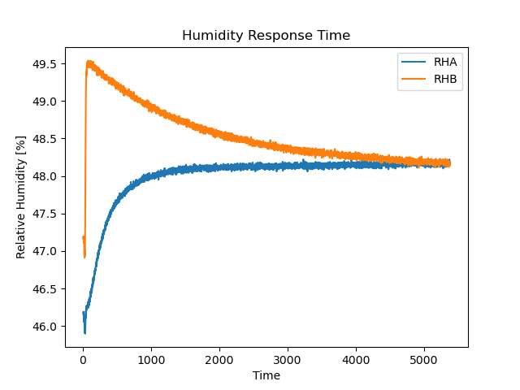

# Testing - Humidity

A step response of humidity performance was evaluated with the use of a ultrasonic humidifier and a general purpose test chamber. 

### Procedure 
A pair of Haar sensors (`v0.1` hardware) were placed in a large (5 gallon) sealed chamber - see [Figure 1](images/Fig1.jpg). This chamber was left open and allowed to reach atmospheric equilibrium. Once the humidity was stabilized, an ultrasonic humidifier was used to inject a small amount of extremely humid air (>90%) into the test chamber, increasing the ambient humidity in the box by a small amount (<10%). Once this injection was completed, the inlet ports to the chamber were sealed - isolating the chamber. An ultrasonic humidifier was chosen as it can produce extremely humid air without appreciably affecting the temperature of the environment, which would add undesired variability to the test. This simulates an extreme example of a humidity due to a shift in weather system. Haar data was recorded until such time as both units had reached equilibrium.

Haar data was logged to a computer using the generic Haar [DataRecorder](../DataRecorder/DataRecorder.ino) script with `period` set to 1000ms. In addition, ground truth data was taken using a [HygroVue 10](https://www.campbellsci.com/hygrovue10) sensor. An [SDI-12 Symbiont](https://github.com/RTGS-Lab/Symbiont-SDI12) was used to interface the SDI-12 sensor with the microcontroller board. This data was captured using the [DataRecorder_HygroVue](../DataRecorder_HygroVue/DataRecorder_HygroVue.ino) script. These two captured sets of data were then merged into the single data file presented below.

### Analysis

The sensor with an open enclosure has an almost immediate response, as expected. This is used to establish a start time of the test. We then identify the equilibrium value (max value measured by the sensor in the vented enclosure). The time constant of the system (&tau;) is defined as the time in which is takes the system to reach FinalVal x (1 - 1/e) which is equal to 0.6321 x FinalVal. 

Response times are evaluated for all devices involved and compared in the table below

| **Sensor** | **Response Time (&tau;) [s]** | **Approx. Time to Equilibrium [s]** |
|---:|:---:|:---:|
| HygroVue 10 (Control) | 21 | 105 |
| Haar, Closed | 15 | 75 |
| Haar, Open | 150 | 750 |

The worst case response, as expected, is the closed Haar sensor. Despite this, we find a time to equilibrium of **just over 12 minutes**, which is perfectly reasonable in most situations. Additionally, the open Haar sensor out performs the control sensor. 

[Python](HumidityAnalysis.py)

[Jupyter Notebook](HumidityAnalysis.ipynb)

### Data

[File](Data.csv)

Sensor A - Haar sensor with open 3D printed enclosure 

Sensor B - Haar sensor with solid 3D printed enclosure and Gore-Tex vent