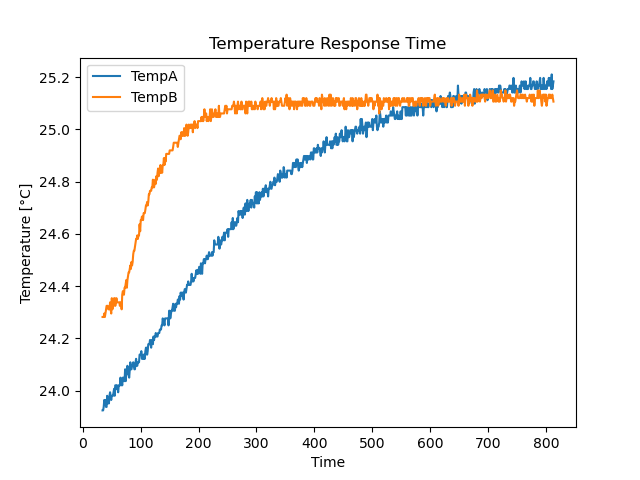
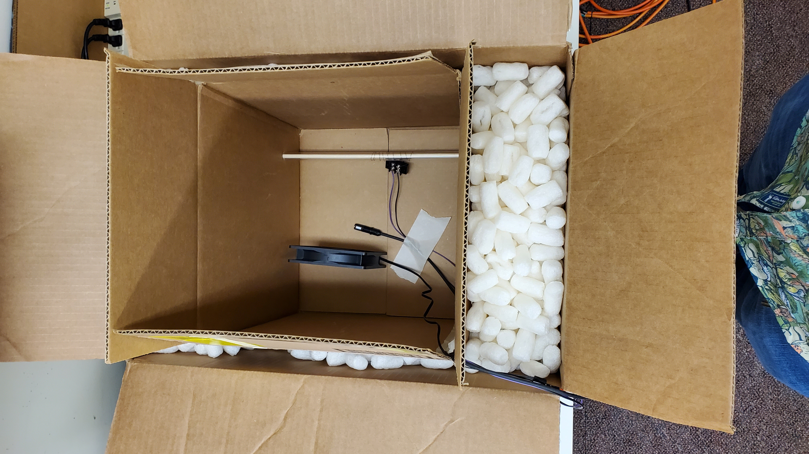
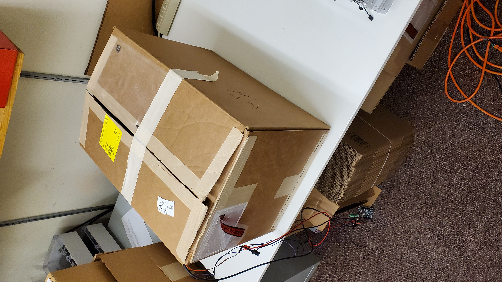

# Testing - Temperature

A test was conducted using a custom built temperature controlled box in order to evaluate the variance in response with an open housing verses a housing with a GoreTex vent  

### Procedure 
A pair of Haar sensors (`v0.1` hardware) were placed in open air and allowed to fully acclimate to stable room temperature (minimum of 60 minutes at a temperature of approximately 21°C). Once this is completed, the sensors are placed into a thermal regulated box held (construction discussed [here](#thermal-regulated-box-construction)) at a temperature of 25°C. Data from the sensors is recorded until after equilibrium is achieved. This procedure subjects the sensors to step response in order to determine the thermal characteristics. 

Haar data was logged to a computer using the generic Haar [DataRecorder](../DataRecorder/DataRecorder.ino) script with `period` set to 100ms.

### Analysis

The sensor with an open enclosure has an almost immediate response, as expected. This is used to establish a start time of the test. We then identify the equilibrium value (max value measured by the sensor in the vented enclosure). The time constant of the system (&tau;) is defined as the time in which is takes the system to reach FinalVal x (1 - 1/e) which is equal to 0.6321 x FinalVal. 

This is evaluated for the data collected and found to be **approximately 13.5 minutes**. 

[Python](TempAnalysis.py)

[Jupyter Notebook](TempAnalysis.ipynb)

### Data

[File](Data.csv)

Sensor A - Haar sensor with solid 3D printed enclosure and Gore-Tex vent

Sensor B - Haar sensor with open 3D printed enclosure 

#### Thermal Regulated Box Construction
A medium (0.03 m^3) box which is placed inside a large (0.065 m^3) box with insulative packing material filling the space between the boxes. Inside the smaller box a temperature sensor ([T9602](https://www.amphenol-sensors.com/en/telaire/humidity/527-humidity-sensors/3224-t9602)), a 12V DC computer fan, and a coil of NiChrome wire are placed - this will along with a micro-controller and power supply constitutes the temperature control system. This contents can be seen in [Figure 2](images/Fig2.jpg). The box is heated by supplying current to the NiChrome coil via a Pulse Width Modulation (PWM) controlled 12V line. The fan is left running at full speed constantly to provide circulation within the box and ensure accurate and consistent temperature measurement. Temperature is sensed using the T9602 sensor by the micro-controller, then the output to the NiChrome heater is varied based on a simple PID controller implemented on the micro-controller. Between the insulation and the active control system the box maintains an accurate and, most importantly, stable temperature.

`ADD CODE FOR ARDUINO CONTROLLER!`